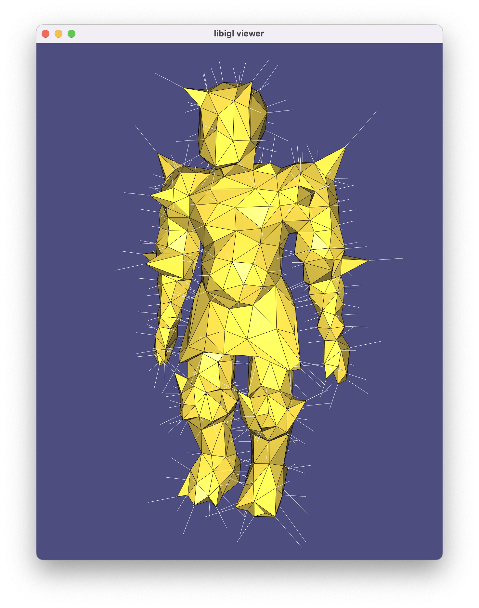

# libigl 🤝 autodiff.github.io

This is a tiny example of how to mix [libigl](libigl.github.io) with
[autodiff™](autodiff.github.io).

## Compile

Compile this project using the standard cmake routine:

    mkdir build
    cd build
    cmake ..
    make

This should find and build the dependencies and create a `example` binary.

## Run

From within the `build` directory just issue:

    ./example

A glfw app should launch displaying a knight with white lines indicating the
computed gradients.

> ### Note about static library
> 
> By default libigl builds as a header only library. When using libigl functions
> with autodiff types (or any non `double` type), it is best to _keep_ building in
> header only mode. Usually this means doing nothing. If you're already using
> static library build of libigl (via `LIBIGL_USE_STATIC_LIBRARY`) then you'll
> either have to turn that off or jump through some hoops to compile the new
> template instantiations needed for whatever functions you call with autodiff™
> types.
